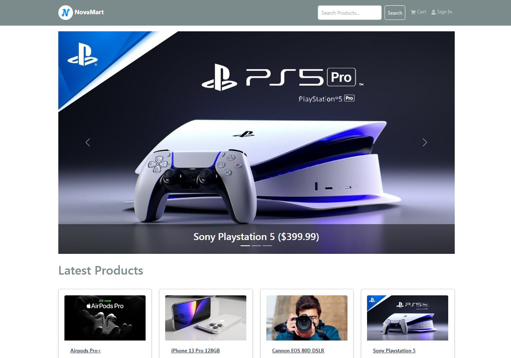
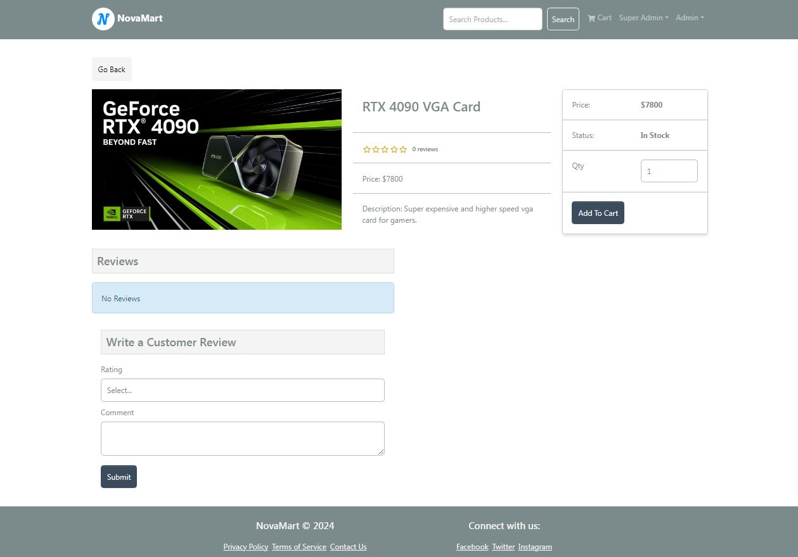

# [Platinum](novamart.onrender.com) &middot; [](https://github.com/facebook/react/blob/main/LICENSE) [](https://legacy.reactjs.org/docs/how-to-contribute.html#your-first-pull-request)

Remember to give me your generous ⭐ Thanks you so very much !!!

Full-stack E-commerce web application built with the MERN stack(MongoDB,Express,React & Node), Bootstrap, Redux toolkit and hosted on Render.com Browse, shop, and checkout with ease! Stay alert for updates..



```javascript
return (
    <>
      {!keyword ? (
        <ProductCarousel />
      ) : (
        <Link to="/" className="btn btn-light mb-4">
          Go Back
        </Link>
      )}
      {isLoading ? (
        <Loader />
      ) : error ? (
        <Message variant="danger">
          {error?.data?.message || error.error}
        </Message>
      ) : (
        <>
          <h1>Latest Products</h1>
          <Row>
            {data.products.map((product) => (
              <Col key={product._id} sm={12} md={6} lg={4} xl={3}>
                <Product product={product} />
              </Col>
            ))}
          </Row>
          <Paginate
            pages={data.pages}
            page={data.page}
            keyword={keyword ? keyword : ""}
          />
        </>
      )}
    </>
  );
};
```

## Table of Contents

- [Features](#features)
- [Used Technologies](#used-technologies)
- [Installation](#installation)
- [Usage](#usage)
- [Contributing](#contributing)
- [License](#license)

### Features

- Full featured shopping cart
- Product reviews and ratings system
- Top products carousel on main page
- Product pagination
- Product search feature
- User profile with orders
- Admin product management
- Admin user management
- Admin Order details page
- Mark orders as delivered option
- Checkout process (shipping, payment method, etc)
- PayPal / credit card integration
- Database seeder (products & users)



### Used Technologies

- **Frontend:**

  - React.js
  - Redux for state management
  - React Router for navigation
  - Bootstrap for css styling

- **Backend:**

  - Node.js
  - Express.js for middleware
  - Mongoose for object modeling
  - JSON Web Tokens (JWT) for authentication

- **Database**

  - MongoDB for product & user detail storing.

- **Payment**

  - Paypal & Card payment methods are available.

- **Hosting:**

  - Render.com for deployment and hosting
  - Web App Demo Link:

### Installation

1. **Clone the repository:**

   ```bash
   git clone https://github.com/DulangaDasanayake/novamart.git
   ```

2. **Navigate to the project directory:**

   ```bash
   cd novamart
   ```

3. **Install dependencies for both frontend and backend:**

   ```bash
   cd client
   npm install
   cd ..
   npm install
   ```

4. **Set up environment variables:**

   Rename the `.env.example` file in the `root` directory and add the following variables:
   Replace `your_mongodb_uri` with your MongoDB connection string and `your_jwt_secret` with a secret key for JWT.

   ```bash
   NODE_ENV = development
   PORT = 5000
   MONGO_URI = your mongodb uri
   JWT_SECRET = your jwt secret key
   PAYPAL_CLIENT_ID = your paypal client id
   ```

### Usage

1. **Start the backend server:**

   ```bash
   cd backend
   npm start
   ```

2. **Start the frontend development server:**

   ```bash
   cd frontend
   npm start
   ```

3. **Start both backend & frontend**

   ```bash
   cd novamart
   npm run dev
   ```

4. **Open your browser and navigate to `http://localhost:3000` to view the application.**

### Contributing

Contributors are warmly welcome! If you'd like to contribute to this project, please follow these steps:

1. Fork the repository.
2. Create a new branch (`git checkout -b feature/new-feature`).
3. Make your changes.
4. Commit your changes (`git commit -am 'Add new feature'`).
5. Push to the branch (`git push origin feature/new-feature`).
6. Create a new Pull Request.

### License

This project is licensed under the MIT License - see the [LICENSE](LICENSE) file for details.

### Thanks Giving ❤️

Thanks for Developers of npm, render.com, paypal, react, node, vs code
vs code extension developers and every each developer that helped me out to finish this project...
